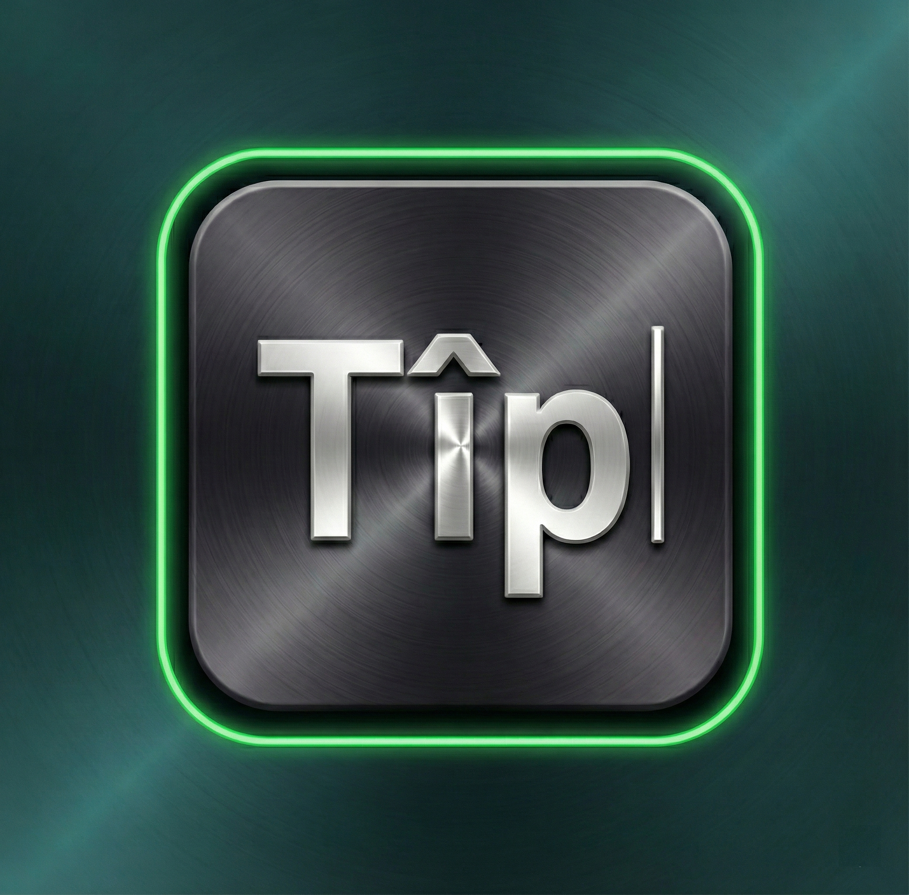

# Tîp - Klavyeya Kurmancî ya Jîr

  

  <strong>The Modern Kurdish (Kurmanji) Keyboard for iOS</strong>

  
  
  
  

---

## Features

### Complete Kurdish Character Support

- All Kurdish special characters: **Ê, Î, Û, Ş, Ç** (uppercase and lowercase)
- Native Kurdish keyboard layout optimized for fast typing
- Beautiful, modern design with dark/light theme support

### Smart Word Prediction

- **N-gram language model** trained on 50,000+ Kurdish sentences
- Context-aware next-word predictions
- Learns from your typing patterns

### Intelligent Autocorrect

- **62,653 Kurdish words** comprehensive dictionary
- **Keyboard-aware Levenshtein distance** algorithm
- Detects typos based on adjacent key positions
- 3-segment suggestion bar (iOS-style):
  - Left: Your typed word
  - Center: Best spelling correction (highlighted)
  - Right: Next-word prediction
- **Non-intrusive**: Shows suggestions, never forces corrections

### Emoji & Stickers

- Full emoji support with categories
- Custom Kurdish stickers
- Quick access emoji picker

### Privacy First

- **100% offline** - works without internet
- **No data collection** - your typing stays private
- **No tracking** - we don't see what you type

## Installation

### From App Store

1. Download [Tîp](https://apps.apple.com/app/tîp) from the App Store
2. Open **Settings** → **General** → **Keyboard**
3. Tap **Keyboards** → **Add New Keyboard**
4. Select **Tîp** from the list
5. Switch to Tîp using 🌍 globe key

### Requirements

- iOS 15.0 or later
- iPhone or iPad

---

## Technical Details

### Architecture

- **Language**: Swift 5.9
- **UI Framework**: UIKit (Keyboard Extension), SwiftUI (Main App)
- **Minimum Deployment**: iOS 15.0

### Key Components

#### 1. Dictionary System

- **62,653 unique Kurdish words**
- Optimized for mobile: 706 KB minified JSON
- Filtered to single words only (multi-word phrases excluded)
- All lowercase for case-insensitive matching

#### 2. N-gram Language Model

- Trained on 50,000+ Kurdish sentences
- 2-5 gram predictions for context-aware suggestions
- Separate from spelling dictionary for better accuracy

#### 3. Autocorrect Engine

- **Keyboard-aware Levenshtein distance**:
  - Adjacent key typos: 0.5 cost (e.g., `a→i`)
  - Non-adjacent typos: 1.0 cost (e.g., `a→l`)
  - Maximum distance threshold: 2.0
- Optimizations:
  - Length filtering (±2 characters)
  - First-letter adjacency check
  - Frequency-based ranking

#### 4. Suggestion Bar (3-Segment Layout)

- Dynamic layout based on context
- Center segment highlighted for corrections
- Falls back to next-word predictions when no correction needed

---

### N-gram Model

Trained on:

- 50,000+ Kurdish sentences
- News articles, literature, and everyday conversation
- Cleaned and validated for quality

---

### Performance

- Dictionary loads in < 100ms on device
- No lag during typing
- Suggestion updates in real-time

## Contributing

We welcome contributions! Here's how you can help:

### Dictionary Improvements

- Submit missing Kurdish words
- Report incorrect spellings
- Suggest word additions

### Bug Reports

Please include:

- iOS version
- Device model
- Steps to reproduce
- Expected vs actual behavior

### Feature Requests

- Describe the feature
- Explain the use case
- Provide examples if applicable

---

## License

This project is licensed under the MIT License

## Acknowledgments

- Kurdish language community for word list contributions
- Beta testers for valuable feedback
- Open-source community for tools and libraries

---

## Links

- [App Store](https://apps.apple.com/app/tîp)
- [Privacy Policy](PRIVACY_POLICY.md)
- [Report an Issue](https://github.com/erhaneth/tip-keyboard/issues)

---

  Made with ❤️ for the Kurdish community

